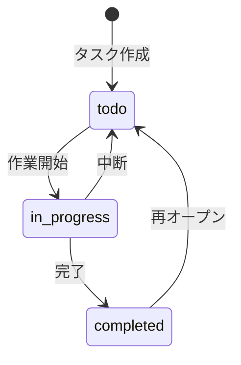

# 用語集作成ガイド

用語集を作成する際の詳細なガイドラインです。

## 基本原則

### 1. 明確で一貫した定義

用語の定義は曖昧さを排除し、誰が読んでも同じ理解ができるようにします。

**悪い例**:

```markdown
## タスク

ユーザーがやるべきこと
```

**良い例**:

```markdown
## タスク (Task)

**定義**: ユーザーが完了すべき作業の単位

**説明**: タイトル、説明、期限、ステータス(未着手/進行中/完了)を持つ

**関連用語**: [サブタスク](#サブタスク)、[タスクグループ](#タスクグループ)

**使用例**:

- 「タスクを追加する」: 新しいタスクをシステムに登録する
- 「タスクを完了する」: タスクのステータスを完了に変更する
```

### 2. 具体例を含める

抽象的な定義だけでなく、具体的な使用例やコード例を示します。

```markdown
## 優先度 (Priority)

**定義**: タスクの重要度と緊急度を示す 3 段階の指標

**値の定義**:
| 値 | 意味 | 判断基準 |
|---|------|---------|
| `high` | 緊急かつ重要 | 期限が 24 時間以内、または他のタスクをブロック |
| `medium` | 重要だが緊急ではない | 期限が 1 週間以内 |
| `low` | 重要度・緊急度ともに低い | 期限が 1 週間以上先、または期限なし |
```

### 3. 関連用語をリンクする

用語同士の関係性を明確にし、相互参照を作成します。

```markdown
**関連用語**:

- [サブタスク](#サブタスク): タスクを細分化したもの
- [タスクグループ](#タスクグループ): 複数のタスクをまとめたもの
```

## 用語の分類方法

### ドメイン用語

**対象**: プロジェクト固有のビジネス概念

**必須項目**:

- 定義（1-2 文）
- 説明（詳細、背景、制約）
- 関連用語
- 使用例

### 技術用語

**対象**: 使用している技術、フレームワーク、ツール

**必須項目**:

- 定義
- 公式サイト URL
- 本プロジェクトでの用途
- バージョン
- 設定ファイルパス（該当する場合）

### 略語・頭字語

**原則**:

- 正式名称を明記
- 初出時は略語と正式名称を併記

**例**:

```markdown
## CLI

**正式名称**: Command Line Interface

**意味**: コマンドラインから操作するインターフェース

**本プロジェクトでの使用**: メインのユーザーインターフェース
```

### アーキテクチャ用語

**対象**: システム設計・パターンに関する概念

**必須項目**:

- 定義
- 本プロジェクトでの適用方法
- 図解（Mermaid 記法推奨）

## 状態遷移の定義

エンティティのステータスや状態を定義する際は:

1. **表形式で列挙**: 全ての状態を一覧化
2. **遷移条件を明記**: どの条件で状態が変わるか
3. **Mermaid 図で可視化**: 状態遷移を図解

````markdown
## タスクステータス (Task Status)

| ステータス    | 意味   | 遷移条件               | 次の状態                |
| ------------- | ------ | ---------------------- | ----------------------- |
| `todo`        | 未着手 | タスク作成時の初期状態 | `in_progress`           |
| `in_progress` | 進行中 | ユーザーがタスクを開始 | `completed`, `todo`     |
| `completed`   | 完了   | ユーザーがタスクを完了 | `todo` (再オープン可能) |

**状態遷移図**:


````

## エラー・例外の定義

**必須項目**:

- クラス名
- 発生条件
- 対処方法（ユーザー向け/開発者向け）
- エラーコード（該当する場合）

```markdown
## バリデーションエラー (Validation Error)

**クラス名**: `ValidationError`

**発生条件**: ユーザー入力がビジネスルールに違反した場合

**対処方法**:

- ユーザー: エラーメッセージに従って入力を修正
- 開発者: バリデーションロジックが正しいか確認

**エラーコード**: `VAL-XXX`
```

## 用語追加の判断基準

**追加すべき用語**:

- 新しい概念が導入された
- チームメンバーから質問があった用語
- ドキュメントで 3 回以上出現する用語
- 外部サービスや API を統合した時

**追加不要な用語**:

- プログラミング一般の用語（変数、関数など）
- 一度しか使わない一時的な用語

## チェックリスト

- [ ] 全ての用語が明確に定義されている
- [ ] 具体例が含まれている
- [ ] 関連用語がリンクされている
- [ ] カテゴリが適切に分類されている
- [ ] 技術用語にバージョン情報がある
- [ ] 略語に正式名称が記載されている
- [ ] 状態遷移が図解されている
- [ ] 索引が整理されている
