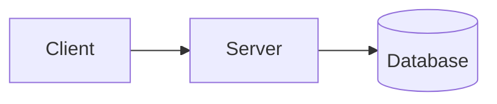

# Marp スライドテンプレート

このテンプレートは、スライド作成の出発点として使用できます。目的に応じて適切なテンプレートを選択してください。

---

## 基本テンプレート

最もシンプルなスライドテンプレートです。

````markdown
---
marp: true
theme: default
paginate: true
---

<!-- _class: lead -->

# プレゼンテーションタイトル

サブタイトル / 発表者名

---

# アジェンダ

1. はじめに
2. 本題
3. まとめ

---

# セクション 1: はじめに

- ポイント 1
- ポイント 2
- ポイント 3

---

# セクション 2: 本題

詳細な説明をここに記載します。

---

# セクション 3: まとめ

- 結論 1
- 結論 2
- 結論 3

---

<!-- _class: lead -->

# ご清聴ありがとうございました

質疑応答
````

---

## ビジネスプレゼンテーション テンプレート

企業向けの発表に適したテンプレートです。

````markdown
---
marp: true
theme: default
paginate: true
header: '**会社名** - プロジェクト名'
footer: '機密 - 社外秘'
style: |
  section {
    font-family: 'Noto Sans JP', 'Helvetica Neue', Arial, sans-serif;
  }
  header {
    color: #666;
  }
  footer {
    color: #999;
    font-size: 12px;
  }
---

<!-- _class: lead -->
<!-- _header: '' -->
<!-- _footer: '' -->
<!-- _paginate: false -->

# プロジェクト提案書

## サブタイトル

**発表者名**
2024年1月1日

---

# エグゼクティブサマリー

- **目的**: プロジェクトの目的を簡潔に
- **提案内容**: 主要な提案事項
- **期待効果**: 期待される成果

---

# 背景と課題

## 現状の課題

1. 課題 1 の説明
2. 課題 2 の説明
3. 課題 3 の説明

---

# 提案ソリューション


## 解決策

- アプローチ 1
- アプローチ 2
- アプローチ 3

---

# 実装計画

| フェーズ | 期間 | 内容 |
|---------|------|------|
| Phase 1 | 1ヶ月 | 要件定義 |
| Phase 2 | 2ヶ月 | 開発 |
| Phase 3 | 1ヶ月 | テスト・展開 |

---

# 予算

| 項目 | 金額 |
|------|------|
| 開発費 | ¥X,XXX,XXX |
| 運用費 | ¥XXX,XXX/月 |
| **合計** | **¥X,XXX,XXX** |

---

# 期待効果

- **コスト削減**: XX% のコスト削減
- **効率化**: 作業時間 XX% 短縮
- **品質向上**: エラー率 XX% 減少

---

<!-- _class: lead -->
<!-- _header: '' -->
<!-- _footer: '' -->

# ご質問はありますか？

連絡先: email@example.com
````

---

## 技術プレゼンテーション テンプレート

技術的な内容の発表に適したテンプレートです。

````markdown
---
marp: true
theme: default
paginate: true
style: |
  section {
    font-family: 'Fira Code', 'Source Code Pro', monospace;
  }
  code {
    background-color: #f4f4f4;
  }
---

<!-- _class: lead -->

# 技術タイトル

## サブタイトル

発表者名 / @username

---

# 今日話すこと

* トピック 1
* トピック 2
* トピック 3

---

# 問題設定

```
従来のアプローチでは...
- 問題点 1
- 問題点 2
```

---

# 解決策: 新しいアプローチ

```python
def new_approach():
    """
    新しいアプローチの実装例
    """
    result = process_data()
    return optimize(result)
```

---

# アーキテクチャ



---

# パフォーマンス比較

| 手法 | 処理時間 | メモリ使用量 |
|------|----------|--------------|
| 従来 | 100ms | 512MB |
| 新規 | 10ms | 128MB |

**10倍の高速化を達成**

---

# デモ


---

# まとめ

- ポイント 1: 重要な発見
- ポイント 2: 実装のコツ
- ポイント 3: 今後の展望

---

# 参考資料

- [リンク 1](https://example.com)
- [リンク 2](https://example.com)
- [リンク 3](https://example.com)

---

<!-- _class: lead -->

# Thank You!

GitHub: @username
Twitter: @username
````

---

## 教育・セミナー テンプレート

教育目的やワークショップに適したテンプレートです。

````markdown
---
marp: true
theme: gaia
paginate: true
backgroundColor: #fff
---

<!-- _class: lead -->
<!-- _backgroundColor: #246 -->
<!-- _color: #fff -->

# 講座タイトル

## レッスン X: トピック名

講師名

---

# 学習目標

このレッスンを終えると、以下ができるようになります：

1. 目標 1 の説明
2. 目標 2 の説明
3. 目標 3 の説明

---

# 前提知識

- 必要な前提知識 1
- 必要な前提知識 2

---

# セクション 1: 基礎概念

## 定義

> **用語**: 用語の定義をここに記載

---

# 概念の説明


- ポイント 1
- ポイント 2
- ポイント 3

---

# 例題

## 問題

次の計算を行ってください：

$$
f(x) = x^2 + 2x + 1
$$

---

# 解答

$$
f(x) = x^2 + 2x + 1 = (x + 1)^2
$$

**ポイント**: 因数分解のパターンを覚えましょう

---

# 演習問題

1. 問題 1
2. 問題 2
3. 問題 3

**制限時間**: 10分

---

# 演習の解答

1. 解答 1 の説明
2. 解答 2 の説明
3. 解答 3 の説明

---

# セクション 2: 応用

## 実践的な使用例

- 使用例 1
- 使用例 2

---

# まとめ

## 今日学んだこと

- 学習ポイント 1
- 学習ポイント 2
- 学習ポイント 3

---

# 次回予告

**次回のトピック**: 次のレッスン内容

## 予習課題

- 課題 1
- 課題 2

---

<!-- _class: lead -->
<!-- _backgroundColor: #246 -->
<!-- _color: #fff -->

# 質問タイム

ご不明な点はありますか？
````

---

## 画像活用テンプレート

画像を効果的に使用するテンプレートです。

````markdown
---
marp: true
theme: uncover
paginate: true
---

<!-- _class: lead -->


# 印象的なタイトル

## サブタイトル

---

# 左右分割レイアウト


## 右側のコンテンツ

- ポイント 1
- ポイント 2
- ポイント 3

---

# 複数画像の並列表示


---

# 背景画像 + オーバーレイ

<!-- _backgroundColor: rgba(0,0,0,0.6) -->
<!-- _color: #fff -->


## 半透明の背景でテキストを読みやすく

- ポイント 1
- ポイント 2

---

# グレースケール背景


## モノクロでシックな印象

---

# セピア効果


## レトロな雰囲気を演出
````

---

## 使用上の注意

1. **画像パスの調整**: テンプレート内のプレースホルダー画像 URL は実際の画像パスに置き換えてください
2. **テーマの選択**: 用途に応じて `default`、`gaia`、`uncover` から選択
3. **カスタマイズ**: `style` ディレクティブでフォントや色をカスタマイズ可能
4. **ページ番号**: `paginate: true` でページ番号を表示、タイトルスライドでは `<!-- _paginate: false -->` で非表示に
