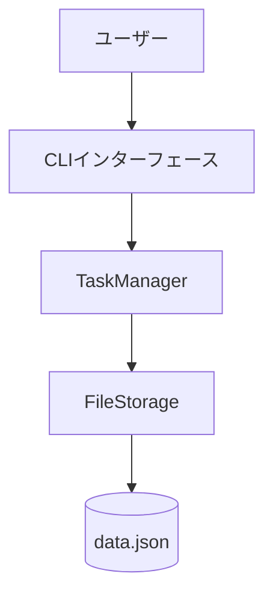
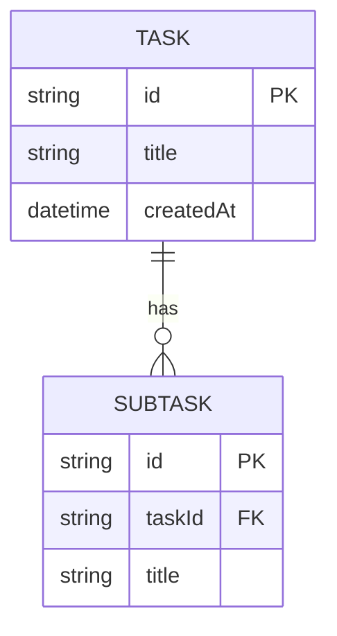
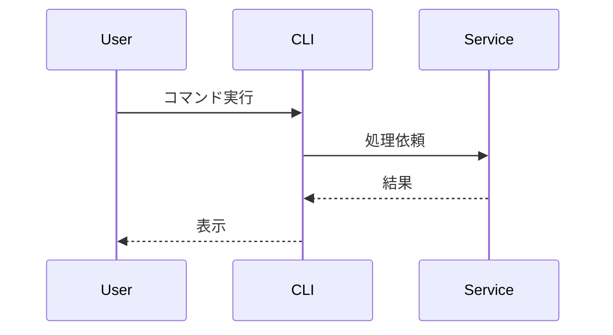

# 機能設計書作成ガイド

PRD の要件を技術的に実現する方法を詳細化するためのガイドです。

## Mermaid 記法

### システム構成図



### ER 図



### シーケンス図



## TypeScript 型定義

データモデルは TypeScript インターフェースで定義します:

```typescript
interface Task {
  id: string; // UUID v4
  title: string; // 1-200文字
  description?: string; // オプション
  status: "todo" | "in_progress" | "completed";
  createdAt: Date;
  updatedAt: Date;
}
```

ポイント:

- 各フィールドにコメントで説明を追加
- 制約（文字数、形式など）を明記
- オプションフィールドには `?` を付ける

## コンポーネント設計

### レイヤー分離

**CLI レイヤー**: ユーザー入力の受付、バリデーション、結果の表示
**サービスレイヤー**: ビジネスロジックの実装
**データレイヤー**: データの永続化と取得

### インターフェース定義例

```typescript
class TaskManager {
  createTask(data: CreateTaskData): Task;
  listTasks(filter?: FilterOptions): Task[];
  updateTask(id: string, data: UpdateTaskData): Task;
  deleteTask(id: string): void;
}
```

## アルゴリズム設計

複雑なロジックは以下の形式で詳細化:

1. **目的**: 何を計算/判定するか
2. **入力**: 必要なパラメータ
3. **計算ステップ**: 順序立てた処理手順
4. **出力**: 結果の形式と範囲
5. **実装例**: TypeScript コード

### 例: スコア計算

```typescript
function calculateScore(task: Task): number {
  // ステップ1: 基本スコア
  const baseScore = task.status === "completed" ? 100 : 50;

  // ステップ2: 調整
  const adjustment = task.priority === "high" ? 20 : 0;

  // ステップ3: 最終スコア
  return baseScore + adjustment;
}
```

## 作成時の原則

1. **PRD との整合性**: P0/MVP 機能を優先
2. **実装可能なレベル**: 開発者が迷わず実装できる詳細度
3. **該当セクションのみ**: 不要なセクションは省略
