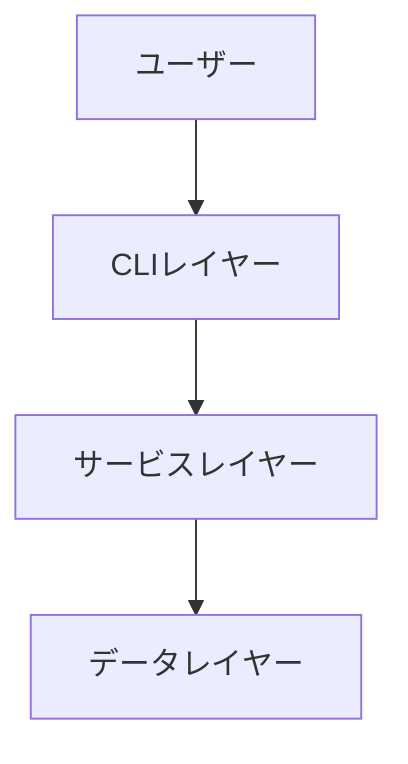
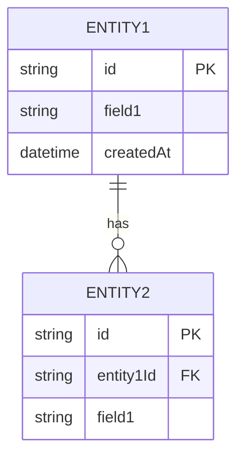
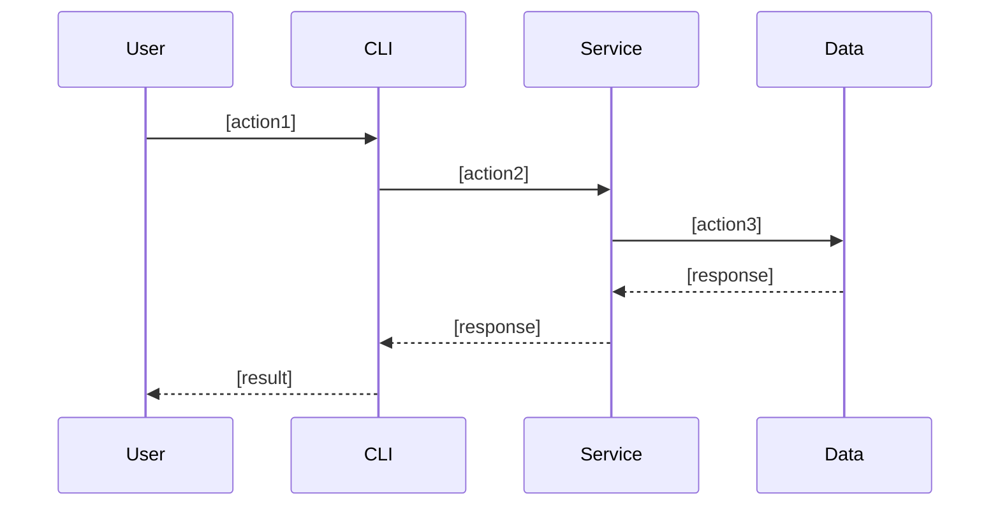

# 機能設計書 (Functional Design Document)

## システム構成図



## 技術スタック

| 分類           | 技術     | 選定理由 |
| -------------- | -------- | -------- |
| 言語           | [言語名] | [理由]   |
| フレームワーク | [名称]   | [理由]   |
| データベース   | [名称]   | [理由]   |
| ツール         | [名称]   | [理由]   |

## データモデル定義

### エンティティ: [エンティティ名]

```typescript
interface [EntityName] {
  id: string;              // UUID
  [field1]: [type];        // [説明]
  createdAt: Date;         // 作成日時
  updatedAt: Date;         // 更新日時
}
```

**制約**:

- [制約 1]
- [制約 2]

### ER 図（複数エンティティがある場合）



## コンポーネント設計

### [コンポーネント名]

**責務**:

- [責務 1]
- [責務 2]

**インターフェース**:

```typescript
class [ComponentName] {
  [method1]([params]): [return];
  [method2]([params]): [return];
}
```

**依存関係**:

- [依存先 1]

## ユースケース図

### [ユースケース名]



**フロー説明**:

1. [ステップ 1]
2. [ステップ 2]

## アルゴリズム設計（該当する場合）

### [アルゴリズム名]

**目的**: [説明]

**計算ロジック**:

1. [ステップ 1]: [説明]
2. [ステップ 2]: [説明]

**実装例**:

```typescript
function [algorithmName]([params]): [return] {
  // 実装
}
```

## API 設計（該当する場合）

### [エンドポイント名]

```
[METHOD] /api/[resource]
```

**リクエスト**:

```json
{
  "[field]": "[value]"
}
```

**レスポンス**:

```json
{
  "id": "uuid",
  "[field]": "[value]"
}
```

**エラーレスポンス**:

- 400: [条件]
- 404: [条件]
- 500: [条件]

## エラーハンドリング

| エラー種別 | 処理       | ユーザーへの表示 |
| ---------- | ---------- | ---------------- |
| [種別 1]   | [処理内容] | [メッセージ]     |
| [種別 2]   | [処理内容] | [メッセージ]     |

## テスト戦略

- **ユニットテスト**: [対象]
- **統合テスト**: [シナリオ]
- **E2E テスト**: [シナリオ]
