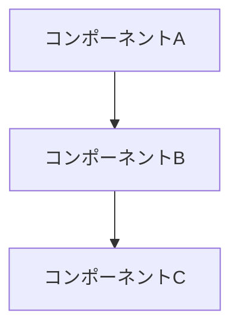
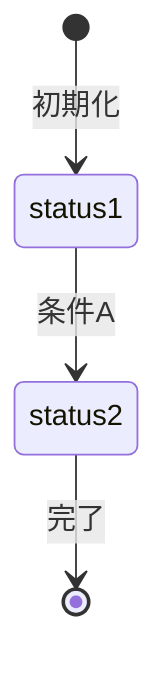

# プロジェクト用語集 (Glossary)

## 概要

このドキュメントは、プロジェクト内で使用される用語の定義を管理します。

**更新日**: YYYY-MM-DD

---

## ドメイン用語

プロジェクト固有のビジネス概念や機能に関する用語。

### [用語名] (English Term)

**定義**: [1-2 文での簡潔な定義]

**説明**: [詳細な説明、背景、制約]

**関連用語**: [関連する他の用語へのリンク]

**使用例**:

- [具体的な使用シーン 1]
- [具体的な使用シーン 2]

---

## 技術用語

プロジェクトで使用している技術・フレームワーク・ツールに関する用語。

### [技術名]

**定義**: [技術の簡潔な説明]

**公式サイト**: [URL]

**本プロジェクトでの用途**: [どのように使用しているか]

**バージョン**: [使用バージョン]

**関連ドキュメント**: [内部ドキュメントへのリンク]

**設定ファイル**: [設定ファイルのパス]

---

## 略語・頭字語

### [略語]

**正式名称**: [Full Name]

**意味**: [説明]

**本プロジェクトでの使用**: [どこで使われているか]

---

## アーキテクチャ用語

システム設計・アーキテクチャに関する用語。

### [概念名]

**定義**: [アーキテクチャ概念の説明]

**本プロジェクトでの適用**: [どのように実装されているか]

**関連コンポーネント**: [関連するコンポーネント名]

**図解**:

---

## ステータス・状態

システム内で使用される各種ステータスの定義。

### [ステータス種別]

| ステータス | 意味   | 遷移条件 | 次の状態   |
| ---------- | ------ | -------- | ---------- |
| `status1`  | [説明] | [条件]   | [次の状態] |
| `status2`  | [説明] | [条件]   | [次の状態] |

**状態遷移図**:

---

## データモデル用語

データベース・データ構造に関する用語。

### [エンティティ名]

**定義**: [エンティティの説明]

**主要フィールド**:

| フィールド | 型     | 説明   |
| ---------- | ------ | ------ |
| `id`       | string | UUID   |
| `field1`   | [type] | [説明] |

**関連エンティティ**: [関連するエンティティ]

**制約**: [ユニーク制約、外部キー制約など]

---

## エラー・例外

システムで定義されているエラーと例外。

### [エラー名]

**クラス名**: `[ErrorClassName]`

**発生条件**: [どういう時に発生するか]

**対処方法**:

- ユーザー: [ユーザーがすべきこと]
- 開発者: [開発者がすべきこと]

**エラーコード**: [該当する場合]

---

## 索引

### あ行

- [用語] - [カテゴリ]

### か行

- [用語] - [カテゴリ]

### A-Z

- [Term] - [Category]
