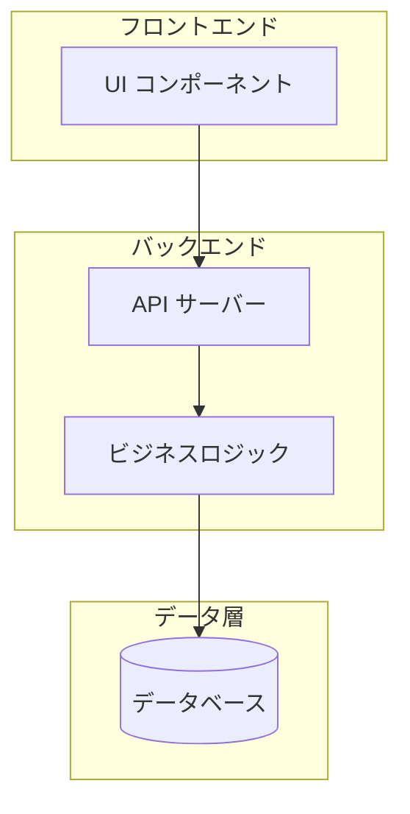
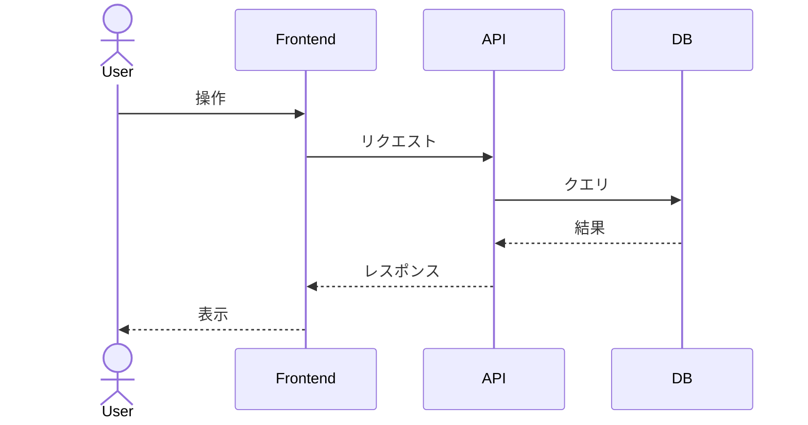
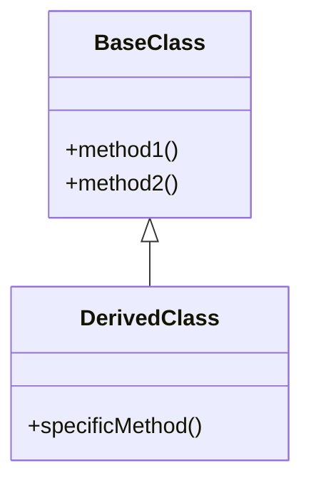
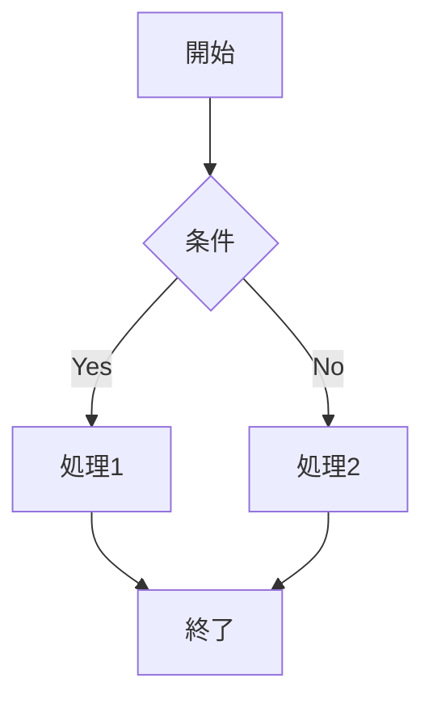

# リバースエンジニアリングレポート作成ガイド

## 概要

このガイドは、効果的なリバースエンジニアリングレポートを作成するためのベストプラクティスを提供します。

## レポート作成の原則

### 1. 対象読者を意識する

- **技術者向け**: 詳細な実装、コードスニペット、アルゴリズムの説明を含める
- **非技術者向け**: 概要レベルの説明を重視し、専門用語には説明を付ける
- **混合読者**: Executive Summary で概要を提供し、詳細は後続セクションで説明

### 2. 明確さと簡潔さ

- 専門用語は避け、使用する場合は定義する
- 一文一義を心がける
- 箇条書きやリストを活用して情報を整理する
- 冗長な表現を避ける

### 3. 視覚資料の活用

Mermaid 記法を使用して、以下を図示することを推奨：

#### アーキテクチャ図

#### シーケンス図

#### クラス図

#### フローチャート

### 4. 客観性の維持

- 事実と推測を明確に区別する
- 推測を記載する場合は「〜と推測される」「〜の可能性がある」と明記
- 根拠となるソース（ファイル、行番号、ドキュメント）を記載

### 5. 整合性の確保

- 用語は一貫して使用する
- 図の凡例や表記法を統一する
- 章番号やセクション参照を正確に維持する

## セクション別作成ガイド

### Executive Summary（概要）

- **長さ**: 1ページ以内
- **内容**: 目的、主要な発見、結論のみ
- **読者**: 意思決定者、非技術者
- **ヒント**: 詳細を知りたい読者が該当セクションを見つけられるよう、簡潔な導線を提供

### Introduction（はじめに）

- **目的**: レポートの背景と意義を明確に
- **調査対象**: リポジトリ URL、バージョン情報、開発元を具体的に
- **スコープ**: 含まれるものと含まれないものを明示

### Subject Overview（調査対象の概要）

- ディレクトリ構造はツリー形式で視覚化
- 依存関係は表形式でまとめる
- 外部仕様と内部実装を分けて記述

### Analysis Results（分析結果）

- アーキテクチャは必ず図示する
- コンポーネント間の関係を明確にする
- データフローは時系列で説明

### Key Findings（主要な発見）

- 発見を重要度順にリスト化
- 各発見に根拠を付ける
- 肯定的な発見と注意点をバランスよく記載

### Conclusion & Recommendations（結論と推奨事項）

- 目的に対する達成度を明記
- 推奨事項は具体的かつ実行可能なものに
- 優先度を付けて整理

## 調査時のチェックリスト

### ドキュメント調査

- [ ] README.md の確認
- [ ] CONTRIBUTING.md、CODE_OF_CONDUCT.md の確認
- [ ] docs/ ディレクトリの確認
- [ ] Wiki の確認
- [ ] API ドキュメントの確認
- [ ] CHANGELOG.md の確認

### 構造分析

- [ ] ディレクトリ構造の把握
- [ ] エントリーポイントの特定
- [ ] 主要モジュールの特定
- [ ] 設定ファイルの確認

### 依存関係分析

- [ ] package.json / requirements.txt / go.mod 等の確認
- [ ] 主要な依存ライブラリのバージョン確認
- [ ] 開発用依存関係と本番用依存関係の区別

### ビルド・デプロイ分析

- [ ] ビルドスクリプトの確認
- [ ] CI/CD 設定の確認
- [ ] 環境変数・設定の確認
- [ ] デプロイ手順の確認

### テスト分析

- [ ] テストフレームワークの特定
- [ ] テストカバレッジの確認
- [ ] テストの種類（単体、統合、E2E）の把握

### コード分析

- [ ] コーディング規約・スタイルの確認
- [ ] 設計パターンの特定
- [ ] エラーハンドリングの方式
- [ ] ロギング・モニタリングの方式

## よくある問題と対処法

### 問題 1: ドキュメントが存在しない

**対処法**: 
- コードコメントから情報を抽出
- コミット履歴から意図を読み取る
- テストコードから仕様を推測

### 問題 2: 複雑すぎて全体像が掴めない

**対処法**:
- まずエントリーポイントから追跡
- 主要なユースケースを特定し、そのフローを追う
- モジュール単位で分割して調査

### 問題 3: 古いコードと新しいコードが混在

**対処法**:
- Git blame で変更履歴を確認
- 最近のコミットに重点を置く
- 非推奨（deprecated）のコードを識別

## 用語定義の推奨

レポート内で使用する用語は、初出時に定義することを推奨します：

| 用語 | 定義 |
|------|------|
| モジュール | 特定の機能を提供する独立したコード単位 |
| コンポーネント | UI やビジネスロジックを構成する再利用可能な部品 |
| サービス | 外部からアクセス可能な機能を提供するモジュール |
| ハンドラー | 特定のイベントやリクエストを処理する関数 |

## 参考資料

リバースエンジニアリングを行う際に参考になる資料：

- [Mermaid 公式ドキュメント](https://mermaid.js.org/) - ダイアグラム作成
- [The Architecture of Open Source Applications](https://aosabook.org/) - オープンソースアーキテクチャの解説
- [Refactoring.Guru](https://refactoring.guru/) - 設計パターンの解説
