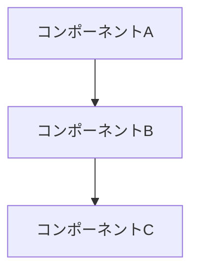
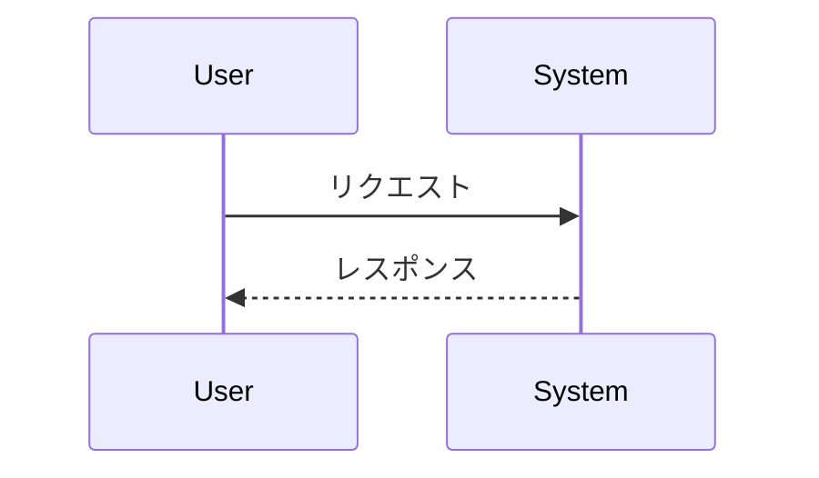

# リバースエンジニアリングレポート テンプレート

以下のフォーマットに従ってレポートを作成してください。
各セクションのコメントは、記載すべき内容のガイドラインです。

---

# 1. 概要 (Executive Summary)

<!-- レポート全体の要約。
リバースエンジニアリングの目的、主要な発見、および結論を簡潔に記述します。
技術的な詳細を理解しない上層部や非技術者向けのセクションです。 -->

# 2. はじめに (Introduction)

## 2.1 目的 (Purpose)

<!-- なぜこのリバースエンジニアリングが行われたのかを明確に述べます。
例：プロジェクト理解、ドキュメント作成、メンテナンス基盤の構築など。 -->

## 2.2 調査対象 (Subject of Analysis)

<!-- リバースエンジニアリングの対象となったソフトウェアまたはシステムを特定します。
リポジトリ名、バージョン、開発元などの詳細を含めます。 -->

## 2.3 スコープ (Scope)

<!-- リバースエンジニアリングの範囲と限界を明確にします。
何が対象で、何が対象外なのかを記述します。 -->

## 2.4 方法論の概要 (Overview of Methodology)

<!-- 使用された主要なツールや手法の概要を簡単に説明します。 -->

# 3. 調査対象の概要 (Subject Overview)

## 3.1 論理的特徴 (Logical Characteristics)

<!-- ソフトウェアの機能、アーキテクチャの概要、主要なモジュールやコンポーネントの関係を記述します。 -->

### 3.1.1 ディレクトリ構造 (Directory Structure)

<!-- リポジトリのディレクトリ構造を示し、各ディレクトリの役割を説明します。 -->

```
project-root/
├── src/           # 説明
├── tests/         # 説明
├── docs/          # 説明
└── ...
```

### 3.1.2 ソフトウェア構成 (Software Configuration)

<!-- ソフトウェアのバージョン、依存関係、主要なライブラリやフレームワークの使用状況を記述します。 -->

### 3.1.3 外部仕様 (External Specifications)

<!-- ソフトウェアの外部仕様書や API ドキュメントが存在する場合、それらの概要を記述します。
どのような機能が提供されているか、どのように使用されるかを説明します。 -->

### 3.1.4 内部実装 (Internal Implementation)

<!-- ソフトウェアの内部実装に関する情報。
主要なアルゴリズム、データ構造、通信プロトコルなどを記述します。 -->

## 3.2 予備情報 (Prior Knowledge/Assumptions)

<!-- リバースエンジニアリングを開始する前に得られていた情報や、立てられていた仮説を記述します。 -->

# 4. リバースエンジニアリングの手法 (Reverse Engineering Methodology)

## 4.1 使用ツール (Tools Used)

<!-- 使用した具体的なツールとそのバージョンをリストアップします。
例：静的解析ツール、デバッガ、コード解析ツールなど。 -->

- ツール名 1: 用途
- ツール名 2: 用途

## 4.2 手順 (Procedures)

<!-- リバースエンジニアリングの各ステップを詳細に記述します。
例：ドキュメント調査、静的解析、動的解析、コードリーディングなど。 -->

1. ステップ 1
2. ステップ 2
3. ステップ 3

## 4.3 課題と解決策 (Challenges and Solutions)

<!-- リバースエンジニアリング中に直面した困難な点と、それらをどのように克服したかを記述します。 -->

# 5. 分析結果 (Analysis Results)

## 5.1 アーキテクチャ分析 (Architecture Analysis)

<!-- システムの全体的なアーキテクチャを説明します。
コンポーネント間の関係、データフロー、制御フローを記述します。
Mermaid 記法を使用して図示してください。 -->



## 5.2 主要コンポーネント分析 (Component Analysis)

<!-- 主要なコンポーネントやモジュールの詳細を記述します。 -->

### コンポーネント名 1

- **役割**: 
- **主要な機能**: 
- **依存関係**: 

### コンポーネント名 2

- **役割**: 
- **主要な機能**: 
- **依存関係**: 

## 5.3 データフロー分析 (Data Flow Analysis)

<!-- データがシステム内をどのように流れるかを記述します。
Mermaid 記法を使用して図示してください。 -->



## 5.4 依存関係分析 (Dependency Analysis)

<!-- 使用されているライブラリ、フレームワーク、外部サービスなどを分析します。 -->

# 6. 主要な発見 (Key Findings)

<!-- リバースエンジニアリングによって明らかになった最も重要で特筆すべき点。
目的達成に直接関連する発見を強調します。 -->

## 6.1 設計上の特徴

<!-- アーキテクチャや設計パターンに関する発見 -->

## 6.2 技術的な特徴

<!-- 使用技術、実装パターンに関する発見 -->

## 6.3 注意点・懸念事項

<!-- 潜在的な問題点、改善が必要な領域 -->

# 7. 結論 (Conclusion)

<!-- リバースエンジニアリングの目的が達成されたかどうかを明確に述べます。
主要な発見とそれが持つ意味を簡潔にまとめます。
今後の行動や推奨事項（もしあれば）を提示します。 -->

# 8. 推奨事項 (Recommendations)

<!-- 発見に基づいて推奨される具体的な行動。
このセクションはオプションです。 -->

- 推奨事項 1
- 推奨事項 2
- 推奨事項 3

# 9. 付録 (Appendices)

## 9.1 参考文献 (References)

<!-- レポートで参照した外部ドキュメント、記事、書籍など -->

- [タイトル](URL) - 説明

## 9.2 補足資料

<!-- レポート本文で参照される追加情報。
詳細なログ、コードスニペット、スクリーンショットなど。 -->
